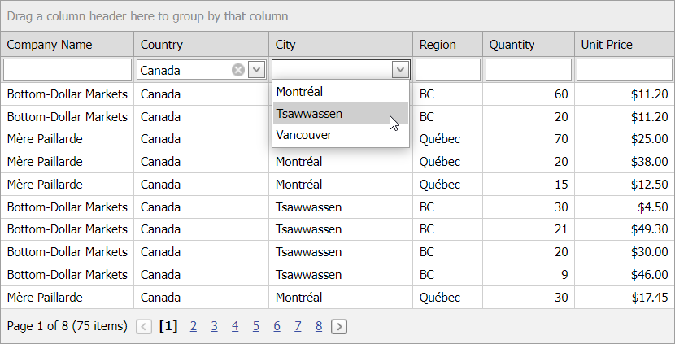

<!-- default badges list -->

<!-- default badges end -->
# Grid View for ASP.NET Web Forms - How to implement cascading combo boxes in the filter row
<!-- run online -->
**[[Run Online]](https://codecentral.devexpress.com/e112/)**
<!-- run online end -->
This example demonstrates how to implement cascading combo boxes in the Grid View control's filter row.

In the example, the filter row displays cascading combo boxes in **Country** and **City** columns. The **Country** combo box is bound to a constant list of countries, while the **City** combo box gets its data from a dynamically generated list of cities based on the selected country.

## Files to Review

* [Default.aspx](./CS/Default.aspx) (VB: [Default.aspx](./VB/Default.aspx))
* [Default.aspx.cs](./CS/Default.aspx.cs) (VB: [Default.aspx.vb](./VB/Default.aspx.vb))

## Documentation

- [Filter Data in Grid View](https://docs.devexpress.com/AspNet/3716/components/grid-view/concepts/filter-data)
- [Grid View Examples](https://docs.devexpress.com/AspNet/3768/components/grid-view/examples)

## More Examples

- [Cascading Combo Boxes](https://github.com/DevExpress-Examples/asp-net-web-forms-grid-cascaded-combo-box-columns)
